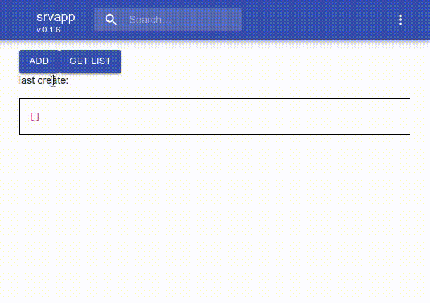

# skeleton netcore ef react ts

skeleton for netcore, db ef code-first ( server side ) + react typescript, json preserve ref ( client side ) solution and docker builder

---

- [recent changes](#recent-changes)
- [features](#features)
- [requirements](#requirements)
- [quickstart](#quickstart)
- [build and run container](#build-and-run-container)
- [update database and diagram](#update-database-and-diagram)

---



## recent changes

- react-scripts 3.3.0 ( support optional chaining )
- centralized webapi try catch

## features

- single solution debug ( just open in code, hit F5, to debug server and client )
- server side
    - net core ef code-first ( with reverse db diagram and typescript generation )
    - net core webapi http2
- client side
    - react typescript ( babel, rollup, webpack )
    - json with [preserve reference](https://github.com/devel0/json-serialize-refs#readme) that allow circular refs
- docker builder
    - allow to cache nuget, npmjs packages

## requirements

- [psql db server](https://github.com/devel0/knowledge/blob/4275a7062f0126631d961afbd0c9d5b5154002d7/doc/create-pgsql-container.md)
- (optional) for db diagramming install [schema crawler](https://github.com/devel0/knowledge/blob/4275a7062f0126631d961afbd0c9d5b5154002d7/doc/psql-schema-crawler.md#L3-L9)
- (optional) for deploy in docker
    - [docker-ubuntu](https://github.com/devel0/docker-ubuntu/blob/c22ed8a57767a23c6af0ea814f693035e67a8351/README.md#L7-L12)
    - [docker-dotnet](https://github.com/devel0/docker-dotnet/blob/b1d4f3be7938505cbd48e460e7274398b85a4d32/README.md#L11-L16)

## quickstart

**clone**

```sh
git clone https://github.com/devel0/skeleton-netcore-ef-react-ts.git YOURPRJ
cd YOURPRJ
code .
```

**configure your variables**

| token | description |
|---|---|
| srvapp | name of the application server+client |
| srvdb | name of database |

| variable | description |
|---|---|
| dbhost | host of database |
| dbname | name of database |

| file | tokens to replace |
|---|---|
| add-migr.sh | srvapp |
| build.sh | srvapp |
| Dockerfile | srvapp |
| gen-ts.sh | srvapp |
| gen-db-dia.sh | srvdb, dbname, dbhost |
| get-cur-ver.sh | srvdb |
| inc-version.sh | srvapp, srvdb |
| srvapp/Code/Global.cs | srvapp, srvdb, dbname, dbhost |

**set pgpass for dev db scripts**

- [see here](https://github.com/devel0/knowledge/blob/4275a7062f0126631d961afbd0c9d5b5154002d7/doc/psql-password-in-file.md)

**tune config.json**

- hit F5 first time to autocreate `~/.config/srvapp/config.json` file
- tune variables into `config.json` to allow server db connection ( note: if use localhost instead an ip then config will not work for dockerized version )

**create database and apply first migration**

```sh
echo "create database srvdb | psql -h localhost -U postgres"
./add-migr.sh
```

**autgen typescript**

```sh
./gen-ts.sh
```

**start**

- from `CTRL+SHIFT+D` select `.NET Core Launch (web)`
- hit F5 from vscode to start server-client

## build and run container

```sh
docker run -p 5555:5000 -v ~/tmp/srvapp-data:/data -v ~/.config/srvapp/config.json:/data/config.json myapps/srvapp
```

output

```
---> env.EnvironmentName=[Production] ; env.IsDevelopment=False
Hosting environment: Production
Content root path: /app
Now listening on: http://[::]:5000
Application started. Press Ctrl+C to shut down.
```

try connect to `http://localhost:5555`

of course for an online usage an https crypt required ( for that use nginx and a letsencrypt certificate )

## update database and diagram


- create/modify tables in `srvapp/Types/db`
- edit `srvapp/MyDbContext.cs` to add [set](https://github.com/devel0/skeleton-netcore-ef-react-ts/blob/90c6e00a56434fba57119c708f7803b3ef3dffc5/srvapp/MyDbContext.cs#L112-L114) and [constraints](https://github.com/devel0/skeleton-netcore-ef-react-ts/blob/90c6e00a56434fba57119c708f7803b3ef3dffc5/srvapp/MyDbContext.cs#L89-L98) such as indexes, unique indexes if required
- execute a new migration `./add-migr.sh`

**about Migrations folder**

- :warning: `srvapp/Migrations` folder not in git ( because other developers may work on other stage of migrations on other database hosts )
- take care to maintain `Migrations` for official or production database in order to apply new migrations

## description of example

- fake authentication ( need to implement your own auth logic )
- two buttons ( add creates new record, get retrieve list of record )
- database store ( eg. [ExampleStore](srvapp/ClientApp/src/components/store/ExampleStore.tsx) ) uses [react-hookstore](https://github.com/jhonnymichel/react-hookstore#readme) to allow working on store from any part of the code with reflection of [result](https://github.com/devel0/skeleton-netcore-ef-react-ts/blob/90c6e00a56434fba57119c708f7803b3ef3dffc5/srvapp/ClientApp/src/components/Home.tsx#L35)
- Datetime
    - in C# DateTime can store Kind local, utc or unspecified and npgsql DateTime gets back from DB as Unspecified so a [little auto-conversion](https://github.com/devel0/skeleton-netcore-ef-react-ts/blob/cc4bfcf1700708628c18be6b98bb2e69586b625d/srvapp/Types/db/SampleTable.cs#L26) needed
    - in Javascript Date mean only localtime
    - when C# DateTime is correcly kinded to UTC will serialized into json as "Z" ending ( utc time ) and correctly converted back when [parseRefsResponse](https://github.com/devel0/skeleton-netcore-ef-react-ts/blob/cc4bfcf1700708628c18be6b98bb2e69586b625d/srvapp/ClientApp/src/components/store/ExampleStore.tsx#L67) into objet

**keynotes**

- server
    - [setup of Newtonsoft JSON](https://github.com/devel0/skeleton-netcore-ef-react-ts/blob/90c6e00a56434fba57119c708f7803b3ef3dffc5/srvapp/Startup.cs#L33-L36) serializer to preserve ref
    - connect [Global](https://github.com/devel0/skeleton-netcore-ef-react-ts/blob/90c6e00a56434fba57119c708f7803b3ef3dffc5/srvapp/Startup.cs#L40) singleton
    - add [db context](https://github.com/devel0/skeleton-netcore-ef-react-ts/blob/90c6e00a56434fba57119c708f7803b3ef3dffc5/srvapp/Startup.cs#L44-L49) with [npgsql plugin](https://github.com/devel0/skeleton-netcore-ef-react-ts/blob/90c6e00a56434fba57119c708f7803b3ef3dffc5/srvapp/Startup.cs#L124-L126)
    - webapi generic [request](https://github.com/devel0/skeleton-netcore-ef-react-ts/blob/90c6e00a56434fba57119c708f7803b3ef3dffc5/srvapp/Types/CommonRequest.cs#L12-L16) and [response](https://github.com/devel0/skeleton-netcore-ef-react-ts/blob/90c6e00a56434fba57119c708f7803b3ef3dffc5/srvapp/Types/CommonResponse.cs#L40-L44)
    - db context [ctx](https://github.com/devel0/skeleton-netcore-ef-react-ts/blob/90c6e00a56434fba57119c708f7803b3ef3dffc5/srvapp/Controllers/CommonController.cs#L26) injected into common controller
    - db connect on a [config.json](https://github.com/devel0/skeleton-netcore-ef-react-ts/blob/90c6e00a56434fba57119c708f7803b3ef3dffc5/srvapp/Code/Config.cs#L11)
    - [add](https://github.com/devel0/skeleton-netcore-ef-react-ts/blob/90c6e00a56434fba57119c708f7803b3ef3dffc5/srvapp/Controllers/ExampleController.cs#L21-L41) and [list](https://github.com/devel0/skeleton-netcore-ef-react-ts/blob/90c6e00a56434fba57119c708f7803b3ef3dffc5/srvapp/Controllers/ExampleController.cs#L43-L60) webapi samples
    - design [constraint of tables](https://github.com/devel0/skeleton-netcore-ef-react-ts/blob/90c6e00a56434fba57119c708f7803b3ef3dffc5/srvapp/Types/db/SampleTable.cs#L13) through interfaces
- client
    - version app request [update check](https://github.com/devel0/skeleton-netcore-ef-react-ts/blob/90c6e00a56434fba57119c708f7803b3ef3dffc5/srvapp/ClientApp/src/index.tsx#L22)
    - general [layout](https://github.com/devel0/skeleton-netcore-ef-react-ts/blob/90c6e00a56434fba57119c708f7803b3ef3dffc5/srvapp/ClientApp/src/App.tsx#L32-L51) with appbar and router switch with public and private routes
    - [error page](https://github.com/devel0/skeleton-netcore-ef-react-ts/blob/90c6e00a56434fba57119c708f7803b3ef3dffc5/srvapp/ClientApp/src/components/ErrorPage.tsx#L69) that shows server exception